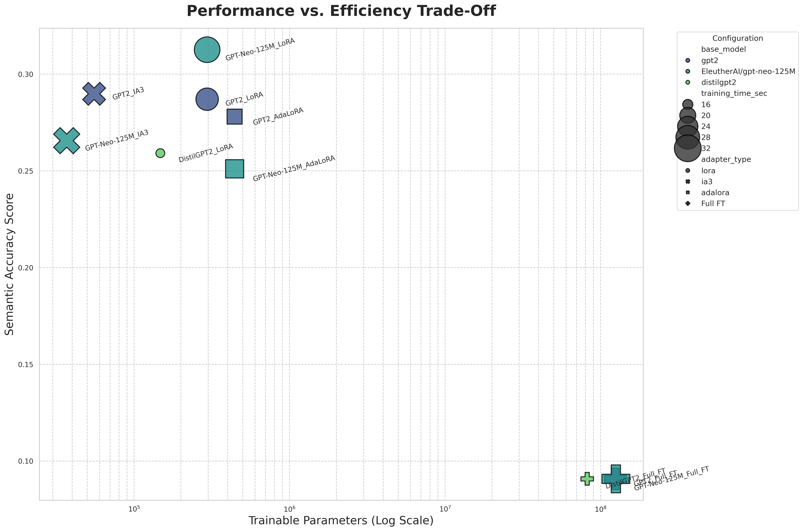
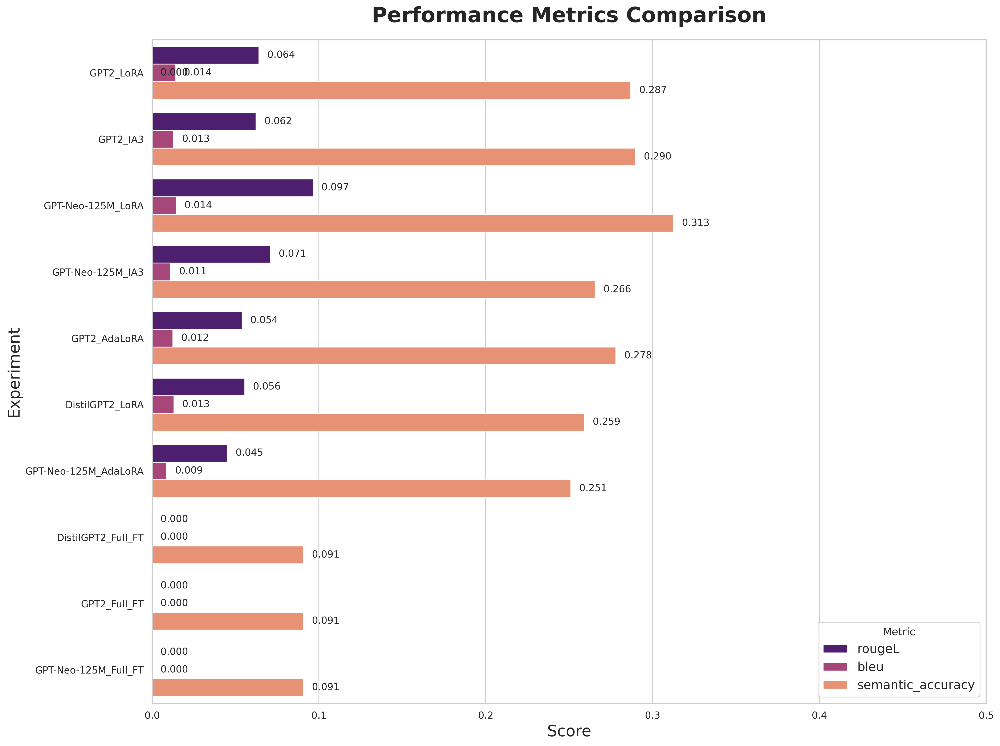
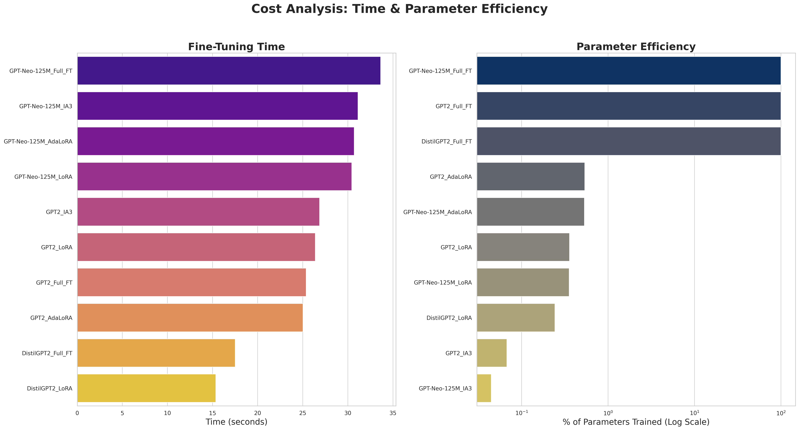

# Modular PEFT Framework for Retrieval-Augmented Generation






## 1. Abstract

This project provides a modular and extensible Python framework for fine-tuning and evaluating Large Language Models (LLMs) on Retrieval-Augmented Generation (RAG) tasks. It leverages various Parameter-Efficient Fine-Tuning (PEFT) methods, such as LoRA, IA³, and AdaLoRA, to significantly reduce computational costs while maintaining high performance. The framework is designed for systematic experimentation, featuring automated experiment execution, detailed metric logging (performance, efficiency, and cost), and a sophisticated analysis dashboard for visualizing the trade-offs between different models and adapter configurations.

### Key Features
- **Modular Design:** Easily swap LLMs, PEFT methods, and datasets via a simple configuration file.
- **Multiple PEFT Methods:** Built-in support for LoRA, IA³, and AdaLoRA.
- **RAG Integration:** Enhances LLM responses by retrieving relevant information from a knowledge base using a FAISS vector index.
- **Custom Semantic Metric:** In addition to ROUGE and BLEU, it evaluates results using a custom semantic accuracy score based on sentence-transformer embeddings.
- **Fully Automated Workflow:**
    1.  **Configure:** Define an entire suite of experiments in a single `config.yaml` file.
    2.  **Execute:** Run all experiments sequentially with a single command (`python main.py`).
    3.  **Analyze:** Generate a comprehensive, multi-panel analysis dashboard with one command (`python analyze_results.py`).

## 2. How It Works

The framework follows a systematic process for each experiment defined in the configuration:

1.  **Configuration:** The `main.py` script reads the list of experiments and global settings from `config.yaml`.
2.  **Data Loading & RAG Setup:** The specified dataset is loaded, and a knowledge base is built by embedding context passages into a FAISS vector index. This step is done only once for all experiments.
3.  **Model & Adapter Loading:** For each experiment, the specified base LLM is loaded in 4-bit precision. The chosen PEFT adapter (e.g., LoRA) is then applied, drastically reducing the number of trainable parameters.
4.  **Fine-Tuning:** The `Trainer` fine-tunes only the small set of adapter parameters. For each question in the dataset, the RAG pipeline retrieves relevant context, which is prepended to the prompt, guiding the model to generate a factually grounded answer.
5.  **Evaluation & Logging:** After training, the model is evaluated on a test set. Performance metrics (ROUGE, BLEU, Semantic Accuracy) and efficiency metrics (training time, parameter counts) are calculated and saved to `results.csv`.
6.  **Analysis:** The `analyze_results.py` script reads the final CSV and generates a detailed dashboard, visualizing the results for easy comparison.

## 3. Setup and Usage

### 3.1. Installation

1.  Clone the repository:
    ```bash
    git clone <your-repo-url>
    cd <your-repo-name>
    ```
2.  Install the required dependencies:
    ```bash
    pip install -r requirements.txt
    ```

### 3.2. Running the Framework

The entire workflow is automated.

1.  **Configure Your Experiments:**
    Open `config.yaml` and define the `experiments` list. You can add, remove, or modify experiments to compare different models and adapters.

2.  **Execute the Experiment Suite:**
    Run the main script from your terminal. It will loop through all experiments, run them, and save the results.
    ```bash
    python main.py
    ```
    The script will automatically skip any experiments that have already been run and logged in `results.csv`, so you can safely stop and resume the process.

3.  **Generate the Analysis Dashboard:**
    Once all experiments are complete, run the analysis script:
    ```bash
    python analyze_results.py
    ```
    This will print a summary table to the console and save the beautiful `advanced_analysis_dashboard.png` to your project directory.

## 4. Example Results & Analysis

The generated dashboard provides a comprehensive overview of the trade-offs involved.

* **Performance vs. Efficiency Plot:** This key visualization immediately shows which configurations provide the best performance for the lowest parameter cost. We can see that PEFT methods achieve comparable (and sometimes better) semantic accuracy than full fine-tuning, but with orders of magnitude fewer trainable parameters.
* **Metric Breakdowns:** The bar charts allow for a direct comparison of all models across all metrics. We can observe, for instance, how `AdaLoRA` might slightly outperform `LoRA` in semantic accuracy while using a similar number of parameters.
* **Cost Analysis:** The time and parameter charts quantify the primary benefit of PEFT. The fine-tuning time for a PEFT method can be a small fraction of a full fine-tuning run, making LLM customization far more accessible.

This framework demonstrates that PEFT methods are a powerful and efficient tool for adapting LLMs to specialized, knowledge-intensive tasks within a RAG pipeline.
