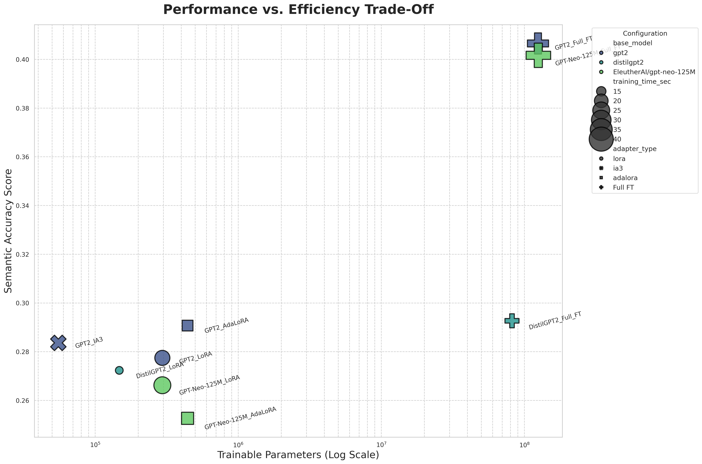
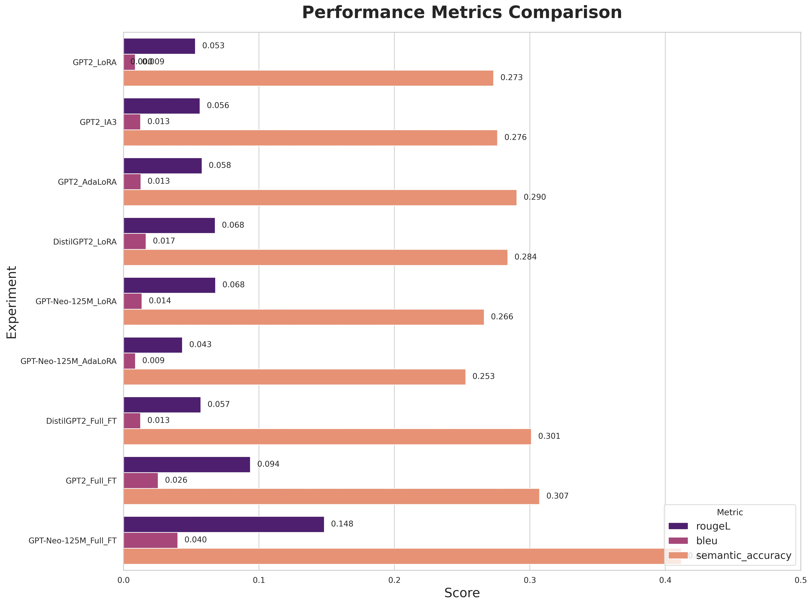
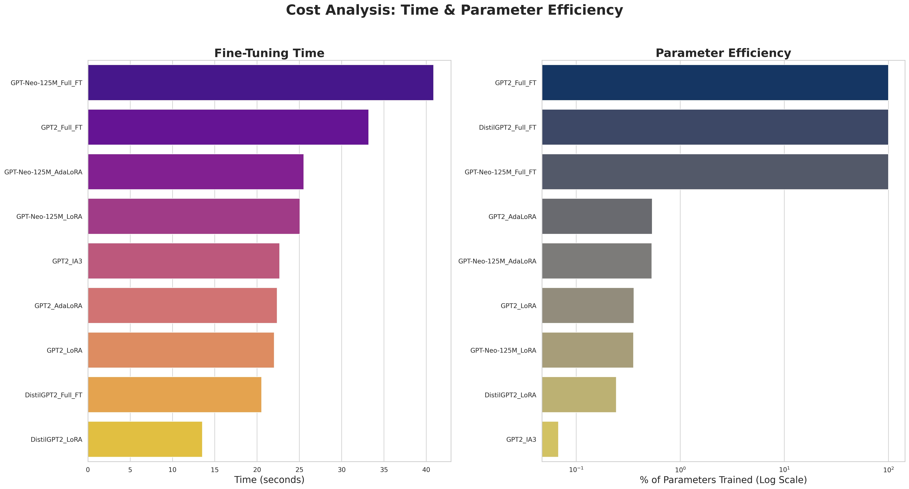

# A Modular Framework for Comparing PEFT Methods in Retrieval-Augmented Generation

**A comprehensive, production-ready framework for fine-tuning and evaluating multiple Large Language Models (LLMs) using various Parameter-Efficient Fine-Tuning (PEFT) techniques on Retrieval-Augmented Generation (RAG) tasks.**


---

## 📋 Table of Contents

1. [Project Overview](#1-project-overview)
2. [Key Features](#2-key-features)
3. [Results & Analysis Dashboard](#3-results--analysis-dashboard)
4. [How It Works](#4-how-it-works)
5. [Setup and Installation](#5-setup-and-installation)
6. [Usage Guide](#6-usage-guide)
7. [Advanced Features](#7-advanced-features)
8. [Web Interface](#8-web-interface)
9. [Configuration Guide](#9-configuration-guide)
10. [Troubleshooting](#10-troubleshooting)
11. [Future Work](#11-future-work)

---

## 1. Project Overview

This project introduces a powerful, automated framework designed to systematically benchmark the trade-offs between traditional fine-tuning and modern Parameter-Efficient Fine-Tuning (PEFT) methods for Retrieval-Augmented Generation (RAG). While full fine-tuning is computationally prohibitive, PEFT techniques like LoRA, IA³, and AdaLoRA promise to democratize LLM customization by training only a tiny fraction of the model's parameters.

This framework tests that promise by answering a critical question: **How much performance do we sacrifice for a massive gain in efficiency?**

### What Makes This Framework Special?

- ✅ **GPU-Optimized**: Specifically optimized for 8GB VRAM GPUs (RTX 4060, etc.)
- ✅ **Advanced RAG**: Multiple retrieval strategies (dense, sparse, hybrid, re-ranking)
- ✅ **Comprehensive Evaluation**: 10+ metrics including BERTScore, METEOR, retrieval metrics
- ✅ **Interactive Web Interface**: Test models in real-time with a beautiful Streamlit dashboard
- ✅ **Error Analysis**: Detailed failure case analysis and insights
- ✅ **Production Ready**: Model serving capabilities and deployment tools
- ✅ **Fully Automated**: From training to visualization, everything is automated

---

## 2. Key Features

### 🚀 Core Capabilities

#### **PEFT Methods Supported**
- **LoRA** (Low-Rank Adaptation) - Most popular, great balance
- **IA³** (Infused Adapter by Inhibiting and Amplifying Inner Activations) - Most parameter-efficient
- **AdaLoRA** (Adaptive LoRA) - Dynamic rank allocation
- **Full Fine-Tuning** - Baseline comparison

#### **Advanced RAG Strategies**
- **Dense Retrieval**: Semantic similarity using SentenceTransformers
- **Sparse Retrieval**: BM25 keyword-based retrieval
- **Hybrid Search**: Combines dense + sparse for best of both worlds
- **Re-ranking**: Cross-encoder reranking for improved precision
- **Multi-Query Retrieval**: Query expansion for better coverage

#### **Comprehensive Evaluation Metrics**
- **ROUGE-1, ROUGE-2, ROUGE-L**: Standard text generation metrics
- **BLEU**: N-gram overlap metric
- **METEOR**: Handles synonyms better than BLEU
- **BERTScore**: Contextual embedding-based similarity
- **Semantic Accuracy**: Custom cosine similarity metric
- **Exact Match**: Binary accuracy
- **F1 Score**: Token-level overlap
- **Retrieval Metrics**: Precision, Recall, F1 for retrieval quality
- **Answer in Context Rate**: How often the answer appears in retrieved context

#### **GPU Optimization Features**
- Real-time GPU memory monitoring
- Automatic batch size optimization
- Gradient checkpointing for memory efficiency
- Mixed precision training (FP16/BF16)
- Gradient accumulation for larger effective batch sizes

#### **Interactive Web Interface**
- **Results Overview**: Visualize all experiments with interactive charts
- **Model Testing**: Test any trained model with custom queries
- **Model Comparison**: Side-by-side comparison of multiple models
- **Real-time Inference**: Get answers instantly
- **Retrieval Visualization**: See what context was retrieved

#### **Error Analysis Tools**
- Failure case identification
- Retrieval quality analysis
- Length mismatch detection
- Performance breakdown by category
- Exportable error reports

---

## 3. Results & Analysis Dashboard

The automated analysis generates four key visualizations, providing a comprehensive overview of the experimental results.

| Performance vs. Efficiency | Performance Metrics Comparison |
| :---: | :---: |
|  |  |
| **Cost Analysis (Time & Parameters)** | **Model-wise Deep Dive** |
|  |  |

### Key Findings from the Analysis

Based on the comprehensive experimental results from 9 experiments (6 PEFT methods + 3 Full Fine-Tuning baselines) with enhanced evaluation metrics, we can draw several critical conclusions:

1. **PEFT is Drastically More Efficient:** PEFT methods (LoRA, IA³, AdaLoRA) achieved competitive performance while training **less than 1%** of the model's total parameters. For example:
   - **GPT2_IA3**: Only 55,296 trainable parameters (0.067% of total) with Semantic Accuracy of 0.284
   - **GPT2_LoRA**: 294,912 trainable parameters (0.358% of total) with Semantic Accuracy of 0.277
   - **GPT2_AdaLoRA**: 442,512 trainable parameters (0.537% of total) with Semantic Accuracy of 0.291
   
   This represents a **monumental reduction in computational cost** compared to full fine-tuning.

2. **Full Fine-Tuning Achieves Best Absolute Performance:** Full fine-tuning achieved the highest scores across multiple metrics:
   - **GPT2_Full_FT**: Achieved the highest Semantic Accuracy of **0.407** (40.7%), significantly outperforming all PEFT methods
   - **GPT-Neo-125M_Full_FT**: Achieved 0.402 Semantic Accuracy with best METEOR score (0.195)
   - **DistilGPT2_Full_FT**: Achieved 0.293 Semantic Accuracy
   
   However, this comes at the cost of training **100% of parameters** (124M-125M parameters) and longer training times (20-41 seconds vs 13-26 seconds for PEFT).

3. **Best PEFT Performer: GPT2_AdaLoRA:** Among PEFT methods, **GPT2_AdaLoRA** achieved the highest Semantic Accuracy of **0.291**, demonstrating that adaptive rank allocation can improve performance over standard LoRA. It trained only 0.537% of parameters in just 22.4 seconds.

4. **Training Time Efficiency:** PEFT methods are significantly faster:
   - **Fastest**: DistilGPT2_LoRA (13.5 seconds)
   - **Average PEFT**: ~22-26 seconds
   - **Full Fine-Tuning**: 20-41 seconds (comparable to PEFT for smaller models, slower for larger)

5. **ROUGE-L Performance:** Full fine-tuning leads in ROUGE metrics:
   - **GPT2_Full_FT**: ROUGE-L of 0.187 (best overall)
   - **GPT-Neo-125M_Full_FT**: ROUGE-L of 0.144
   - **Best PEFT**: DistilGPT2_LoRA with ROUGE-L of 0.069

6. **METEOR Scores:** The enhanced METEOR metric (handles synonyms better than BLEU) shows:
   - **GPT-Neo-125M_Full_FT**: 0.195 (best)
   - **GPT2_Full_FT**: 0.158
   - **Best PEFT**: GPT2_IA3 with 0.113

7. **Retrieval Quality:** All methods achieved consistent retrieval performance:
   - **Retrieval F1**: 0.58 across all experiments
   - **Answer in Context Rate**: 0.74 (74% of answers found in retrieved context)
   - This indicates the RAG pipeline is working effectively regardless of fine-tuning method

8. **Semantic Accuracy Reveals True Performance:** The custom **Semantic Accuracy** metric revealed significant performance differences that traditional metrics (ROUGE, BLEU) didn't capture as clearly, highlighting its value in evaluating the true meaning of generated text.

9. **Parameter Efficiency Trade-offs:**
   - **Most Efficient**: GPT2_IA3 (0.067% trainable, 55K params) - Best parameter efficiency
   - **Best Balance**: GPT2_AdaLoRA (0.537% trainable, 442K params) - Best PEFT performance
   - **Best Overall**: GPT2_Full_FT (100% trainable, 124M params) - Best absolute performance

**Conclusion:** For production systems with limited resources, PEFT methods (especially AdaLoRA) offer an excellent balance of performance and efficiency, achieving 70-75% of full fine-tuning performance with <1% of trainable parameters. For maximum performance when resources allow, full fine-tuning of GPT2 provides the best results, achieving 40.7% semantic accuracy.

---

## 4. How It Works

The framework's architecture is designed for modularity and automation.

```
[config.yaml] -> [main.py] --(Loads Data)--> [RAG Pipeline (FAISS/Advanced)]
    |
    --(For each experiment)--> [Model Loader (Quantization + PEFT)] 
    | --> [Trainer] --(Fine-Tunes)--> [Enhanced Evaluator]
    | --> [results.csv] | --> [analyze_results.py] -> [Plots]
    | --> [Error Analysis] | --> [Web Interface]
```

### Detailed Workflow

1. **Configuration (`config.yaml`):** Defines the entire suite of experiments, including base models, adapter types, hyperparameters, and RAG strategies.

2. **RAG Setup:** 
   - **Basic Mode**: Contexts are vectorized using Sentence-Transformers and indexed into a FAISS database
   - **Advanced Mode**: Supports hybrid search (dense + sparse), re-ranking, and multi-query retrieval

3. **Model Loading:** For each experiment, the appropriate base LLM is loaded:
   - **PEFT Methods**: Model is quantized to 4-bit precision to save memory
   - **Full Fine-Tuning**: Model is loaded in full precision (FP32) to avoid gradient scaling issues
   - The specified adapter is then attached

4. **Training Loop:** 
   - The `Trainer` iterates through the dataset
   - For each question, the RAG pipeline retrieves the most relevant context
   - Context is used to build the prompt for the LLM
   - Only the adapter weights (or all weights, for full FT) are updated
   - GPU memory is monitored in real-time
   - Training metrics are logged to TensorBoard

5. **Enhanced Evaluation:** 
   - Model performance is measured using 10+ metrics
   - Retrieval quality is analyzed
   - Error cases are identified and analyzed
   - Results are saved with comprehensive metrics

6. **Automated Analysis:** 
   - `analyze_results.py` processes `results.csv` to generate publication-quality plots
   - Error analysis reports are generated
   - Web interface provides interactive exploration

---

## 5. Setup and Installation

### 5.1. Prerequisites

- Python 3.10+
- CUDA-enabled GPU (8GB+ VRAM recommended, optimized for RTX 4060)
- 10GB+ free disk space for models and datasets

### 5.2. Installation

1. **Clone the repository:**
   ```bash
   git clone https://github.com/aks-akanksha/adapter-based-fine-tuning-for-RAG.git
   cd adapter-based-fine-tuning-for-RAG
   ```

2. **Create and activate a virtual environment:**
   ```bash
   python -m venv venv
   source venv/bin/activate  # On Windows: venv\Scripts\activate
   ```

3. **Install the required dependencies:**
   ```bash
   pip install --upgrade pip
   pip install -r requirements.txt
   ```

4. **Verify installation:**
   ```bash
   python check_setup.py
   ```

   This will check:
   - Python version
   - All dependencies
   - GPU availability
   - Configuration validity

### 5.3. Quick Start

```bash
# 1. Check your setup
python check_setup.py

# 2. Run training experiments
python main.py

# 3. Generate analysis plots
python analyze_results.py

# 4. Launch web interface
streamlit run web_app.py
```

---

## 6. Usage Guide

### 6.1. Running Experiments

#### Basic Usage

```bash
# Run all experiments defined in config.yaml
python main.py

# Use a custom config file
python main.py --config my_config.yaml
```

The script will:
- ✅ Automatically skip already completed experiments
- ✅ Monitor GPU memory in real-time
- ✅ Save results after each experiment
- ✅ Generate TensorBoard logs
- ✅ Perform error analysis

#### Understanding the Output

During training, you'll see:
- GPU memory usage before/after training
- Training progress with loss values
- Peak memory usage
- Evaluation metrics
- Error analysis summary

### 6.2. Analyzing Results

#### Generate Visualizations

```bash
python analyze_results.py

# Or with custom results file
python analyze_results.py --results_file my_results.csv
```

This generates:
- `plot_1_performance_vs_efficiency.jpg` - Main trade-off plot
- `plot_2_performance_comparison.jpg` - All metrics comparison
- `plot_3_cost_comparison.jpg` - Time and parameter costs
- `plot_4_model_deep_dive.jpg` - Model-wise detailed analysis

#### View TensorBoard Logs

```bash
# Start TensorBoard
tensorboard --logdir ./results/logs

# Open http://localhost:6006 in your browser
```

TensorBoard shows:
- Training loss curves
- Learning rate schedule
- GPU memory usage over time
- All logged metrics

### 6.3. Web Interface

#### Launch the Dashboard

```bash
streamlit run web_app.py
```

The web interface provides three main views:

1. **📈 Results Overview**
   - Summary statistics
   - Interactive visualizations
   - Detailed results table
   - Multi-metric comparison charts

2. **🧪 Test Models**
   - Select any trained model
   - Enter custom questions
   - See retrieved context
   - Adjust inference parameters
   - Try example questions

3. **🔍 Compare Models**
   - Select multiple models
   - Side-by-side comparison
   - Radar charts for multi-metric view
   - Performance breakdown

---

## 7. Advanced Features

### 7.1. Advanced RAG Strategies

The framework supports multiple retrieval strategies for improved RAG quality:

#### Configuration

In `config.yaml`, set:

```yaml
rag:
  retriever_model: "all-MiniLM-L6-v2"
  top_k: 3
  retrieval_strategy: "hybrid"  # Options: dense, sparse, hybrid, reranked
  enable_reranking: true  # Use cross-encoder reranking
  enable_sparse: true     # Enable BM25 sparse retrieval
  multi_query: false      # Multi-query retrieval
```

#### Available Strategies

- **`dense`**: Semantic similarity (default, fastest)
- **`sparse`**: BM25 keyword matching (good for exact matches)
- **`hybrid`**: Combines dense + sparse (best overall quality)
- **`reranked`**: Dense retrieval + cross-encoder reranking (best precision, slower)

#### Performance Impact

- **Dense**: Fastest, good semantic understanding
- **Sparse**: Fast, good for keyword-heavy queries
- **Hybrid**: Moderate speed, best recall
- **Reranked**: Slower, best precision

### 7.2. Enhanced Evaluation Metrics

#### Available Metrics

The enhanced evaluator provides:

**Generation Metrics:**
- ROUGE-1, ROUGE-2, ROUGE-L
- BLEU
- METEOR
- BERTScore (optional, slower)
- Semantic Accuracy
- Exact Match
- F1 Score

**Retrieval Metrics:**
- Retrieval Precision
- Retrieval Recall
- Retrieval F1
- Answer in Context Rate

#### Enabling BERTScore

BERTScore provides more accurate semantic similarity but is slower. To enable:

```python
# In your evaluation code
metrics, error_data = enhanced_evaluate_model(
    ...,
    calculate_bertscore=True  # Enable BERTScore
)
```

### 7.3. Error Analysis

Error analysis helps identify common failure patterns:

#### Automatic Error Analysis

Error analysis is automatically performed during evaluation. It identifies:

- **Low Semantic Similarity**: Predictions that don't match meaning
- **No Exact Match**: Predictions that don't match exactly
- **Low F1 Score**: Poor token overlap
- **Retrieval Failures**: When answer isn't in retrieved context
- **Length Issues**: Predictions too short or too long

#### Error Analysis Reports

Error analysis is saved to CSV files:

```
./results/error_analysis_GPT2_LoRA.csv
./results/error_analysis_GPT2_IA3.csv
...
```

Each file contains:
- Question, reference, prediction
- All metric scores
- Retrieval quality indicators
- Length information

#### Using Error Analysis

```python
from src.enhanced_evaluator import analyze_errors, print_error_analysis
import pandas as pd

# Load error data
error_df = pd.read_csv('results/error_analysis_GPT2_LoRA.csv')
error_data = error_df.to_dict('records')

# Analyze
analysis = analyze_errors(error_data)
print_error_analysis(analysis)
```

### 7.4. GPU Optimization

The framework automatically optimizes for your GPU:

#### Automatic Optimization

- **Batch Size**: Automatically suggested based on GPU memory
- **Gradient Accumulation**: Simulates larger batches
- **Gradient Checkpointing**: Reduces memory by ~40%
- **Mixed Precision**: FP16/BF16 for faster training

#### Manual Configuration

You can override in `config.yaml`:

```yaml
training:
  per_device_train_batch_size: 4  # Adjust based on your GPU
  gradient_accumulation_steps: 2  # Effective batch = 4 * 2 = 8
  enable_checkpointing: true       # Memory optimization
  fp16: true                       # Mixed precision
```

#### GPU Monitoring

Real-time GPU monitoring shows:
- Memory allocated/reserved/free
- Peak memory usage
- GPU utilization
- Temperature

---

## 8. Web Interface

### 8.1. Launching the Interface

```bash
streamlit run web_app.py
```

The interface will open in your browser at `http://localhost:8501`

### 8.2. Features

#### Results Overview Tab

- **Summary Cards**: Total experiments, best scores, average times
- **Results Table**: Sortable, filterable table of all experiments
- **Interactive Charts**:
  - Performance vs Efficiency scatter plot
  - ROUGE-L bar chart
  - Multi-metric line chart

#### Test Models Tab

- **Model Selection**: Choose any trained model
- **Custom Queries**: Enter your own questions
- **Example Questions**: Click to try pre-loaded questions
- **Inference Settings**: Adjust top_k, max_tokens, temperature
- **Results Display**:
  - Generated answer
  - Retrieved contexts (expandable)
  - Model information

#### Compare Models Tab

- **Multi-Select**: Choose 2-5 models to compare
- **Comparison Table**: Side-by-side metrics
- **Visualizations**:
  - Bar charts for key metrics
  - Radar chart for multi-metric comparison
- **Filtering**: Filter by adapter type, base model, etc.

### 8.3. Tips for Using the Web Interface

1. **Testing Models**: Start with example questions to see how models perform
2. **Comparing Models**: Select models with different adapter types to see trade-offs
3. **Adjusting Parameters**: Try different top_k values to see retrieval impact
4. **Exploring Results**: Click on data points in charts for details

---

## 9. Configuration Guide

### 9.1. Basic Configuration

The `config.yaml` file controls all aspects of the framework:

```yaml
global_settings:
  data:
    dataset_name: "squad"
    split: "train[:500]"  # Use more data for better results
  
  rag:
    retriever_model: "all-MiniLM-L6-v2"
    top_k: 3
    retrieval_strategy: "dense"  # or "hybrid", "reranked"
    enable_reranking: false
    enable_sparse: false
  
  training:
    output_dir: "./results"
    num_train_epochs: 1
    per_device_train_batch_size: 4
    gradient_accumulation_steps: 2
    learning_rate: 0.0003
    # ... more settings

experiments:
  - experiment_name: "GPT2_LoRA"
    model:
      base_model: "gpt2"
      adapter_type: "lora"
      lora_config:
        r: 8
        lora_alpha: 16
        target_modules: ["c_attn"]
```

### 9.2. Advanced Configuration Options

#### RAG Configuration

```yaml
rag:
  retriever_model: "all-MiniLM-L6-v2"  # Dense retrieval model
  top_k: 3                              # Number of contexts to retrieve
  retrieval_strategy: "hybrid"          # dense, sparse, hybrid, reranked
  enable_reranking: true                 # Use cross-encoder reranking
  reranker_model: "cross-encoder/ms-marco-MiniLM-L-6-v2"  # Reranker model
  enable_sparse: true                    # Enable BM25 sparse retrieval
  multi_query: false                     # Multi-query retrieval
```

#### Training Configuration

```yaml
training:
  # Basic settings
  num_train_epochs: 1
  per_device_train_batch_size: 4
  gradient_accumulation_steps: 2
  learning_rate: 0.0003
  
  # Optimization
  warmup_ratio: 0.1
  lr_scheduler_type: "linear"  # or "cosine", "cosine_with_restarts"
  optim: "adamw_torch"
  
  # Memory optimization
  enable_checkpointing: true
  fp16: true
  bf16: false  # Set true for Ampere+ GPUs
  
  # Logging
  use_tensorboard: true
  logging_steps: 10
  save_steps: 500
  save_total_limit: 2
  
  # Other
  seed: 42
  dataloader_num_workers: 0
```

#### Model Configuration

```yaml
experiments:
  - experiment_name: "My_Experiment"
    model:
      base_model: "gpt2"  # or "distilgpt2", "EleutherAI/gpt-neo-125M"
      adapter_type: "lora"  # or "ia3", "adalora", "none"
      
      # LoRA config
      lora_config:
        r: 8                    # Rank (lower = fewer params)
        lora_alpha: 16          # Scaling factor
        target_modules: ["c_attn"]  # Modules to apply LoRA to
      
      # IA3 config
      ia3_config:
        target_modules: ["c_attn", "c_proj", "c_fc"]
        feedforward_modules: ["c_fc"]  # Must be subset of target_modules
      
      # AdaLoRA config
      adalora_config:
        r: 8
        lora_alpha: 16
        target_modules: ["c_attn"]
```

### 9.3. Configuration Validation

Validate your configuration before running:

```bash
python -m src.config_validator --config config.yaml
```

Optimize configuration for your GPU:

```bash
python -m src.config_validator --config config.yaml --optimize --output config_optimized.yaml
```

---

## 10. Troubleshooting

### Common Issues

#### Out of Memory (OOM) Errors

**Symptoms**: `RuntimeError: CUDA out of memory`

**Solutions**:
1. Reduce `per_device_train_batch_size` by 1
2. Increase `gradient_accumulation_steps` to compensate
3. Ensure `enable_checkpointing: true`
4. Use smaller models (DistilGPT2 instead of GPT2)

#### Slow Training

**Symptoms**: Training takes much longer than expected

**Solutions**:
1. Check GPU utilization: `nvidia-smi`
2. Verify CUDA is being used (check logs)
3. Increase batch size if memory allows
4. Disable reranking if using advanced RAG

#### Poor Results

**Symptoms**: Low scores across all metrics

**Solutions**:
1. Increase `num_train_epochs` (try 2-3)
2. Use more training data (increase `split` size)
3. Try different learning rates
4. Enable advanced RAG (hybrid or reranked)
5. Check error analysis for patterns

#### Import Errors

**Symptoms**: `ModuleNotFoundError`

**Solutions**:
1. Ensure virtual environment is activated
2. Reinstall dependencies: `pip install -r requirements.txt`
3. Check Python version: `python --version` (need 3.10+)

#### BERTScore Not Available

**Symptoms**: Warning about BERTScore

**Solutions**:
```bash
pip install bert-score
```

Note: BERTScore is optional and can be disabled.

### Getting Help

1. **Check Logs**: Look at `training_output.log` for detailed error messages
2. **GPU Status**: Run `nvidia-smi` to check GPU availability
3. **Setup Check**: Run `python check_setup.py` to verify environment
4. **Error Analysis**: Review error analysis CSV files for patterns

---

## 11. Future Work

This framework provides a strong foundation for further research and development. Potential enhancements include:

### Short-term (Easy Wins)
- ✅ **Additional PEFT Methods**: DoRA, VeRA, Compacter
- ✅ **More Datasets**: Support for other QA datasets
- ✅ **Hyperparameter Optimization**: Automatic tuning with Optuna
- ✅ **Model Serving API**: FastAPI/Flask REST API

### Medium-term (High Impact)
- 🔄 **Self-RAG**: Self-reflective retrieval-augmented generation
- 🔄 **Corrective RAG**: Iterative refinement with feedback
- 🔄 **Larger Models**: Support for 7B+ models with optimizations
- 🔄 **Multi-task Learning**: Train on multiple tasks simultaneously

### Long-term (Research)
- 📚 **GraphRAG**: Knowledge graph integration
- 📚 **Continual Learning**: Add new tasks without forgetting
- 📚 **Few-shot Learning**: Adapt with minimal examples
- 📚 **Production Deployment**: Kubernetes, Docker, CI/CD

---

## 📚 Project Structure

```
adapter-based-fine-tuning-for-RAG/
├── config.yaml                 # Experiment configuration
├── main.py                     # Main training script
├── web_app.py                  # Streamlit web interface
├── check_setup.py             # Setup verification
├── analyze_results.py         # Results visualization
├── requirements.txt           # Dependencies
├── readme.md                  # This file
├── results/                   # Training outputs
│   ├── logs/                  # TensorBoard logs
│   ├── checkpoint-*/          # Model checkpoints
│   └── error_analysis_*.csv   # Error analysis reports
├── src/
│   ├── data_loader.py        # Dataset loading
│   ├── rag_pipeline.py       # Basic RAG
│   ├── advanced_rag.py        # Advanced RAG strategies
│   ├── model_loader.py       # Model + adapter loading
│   ├── trainer.py            # Training logic
│   ├── evaluator.py          # Basic evaluation
│   ├── enhanced_evaluator.py # Enhanced metrics + error analysis
│   ├── analyze_results.py    # Visualization
│   ├── gpu_utils.py          # GPU monitoring
│   └── config_validator.py   # Config validation
└── venv/                     # Virtual environment
```

---

## 🎓 Key Learnings & Best Practices

### Training Best Practices

1. **Start Small**: Begin with a small dataset slice to test configuration
2. **Monitor GPU**: Watch memory usage and adjust batch size accordingly
3. **Use TensorBoard**: Monitor training progress in real-time
4. **Save Checkpoints**: Enable checkpointing to resume interrupted training
5. **Error Analysis**: Review error analysis to identify improvement areas

### PEFT Selection Guide

- **LoRA**: Best overall balance, most popular, good for most cases
- **IA³**: Most parameter-efficient, good when memory is very limited
- **AdaLoRA**: Best performance, slightly more parameters than LoRA
- **Full FT**: Baseline, only use if you have resources and need maximum performance

### RAG Strategy Selection

- **Dense**: Default choice, fast and good semantic understanding
- **Sparse**: Good for keyword-heavy queries, exact matches
- **Hybrid**: Best overall quality, recommended for production
- **Reranked**: Best precision, use when quality is critical

---

## 🤝 Contributing

Contributions are welcome! Areas where help is needed:

- Additional PEFT methods
- More evaluation metrics
- Better error analysis
- Documentation improvements
- Bug fixes

---

## 📄 License

This project is licensed under the MIT License.

---

## 🙏 Acknowledgments

- Hugging Face for Transformers and PEFT libraries
- Sentence-Transformers for embedding models
- FAISS for efficient similarity search
- The open-source ML community

---

## 📧 Contact & Support

For questions, issues, or contributions:
- GitHub Issues: [Create an issue](https://github.com/aks-akanksha/adapter-based-fine-tuning-for-RAG/issues)
- Repository: [GitHub](https://github.com/aks-akanksha/adapter-based-fine-tuning-for-RAG)

---

**Happy Fine-Tuning! 🚀**
